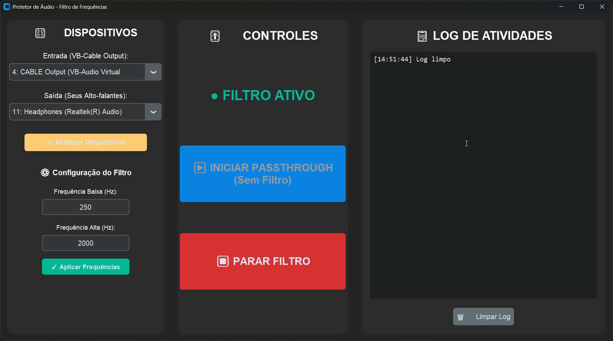

# 🎛️ TEAudio - Filtro de Frequências voltado para a comunidade TEA

Um aplicativo de proteção de áudio em tempo real que filtra frequências causadoras de sobrecarga sensorial para proteger seus ouvidos durante o uso de aplicativos com áudio.

## 📸 Interface



> _Interface gráfica do Protetor de Áudio mostrando controles de dispositivos, filtros e log de atividades_

## 🚀 Características

- **Filtro Bandpass em Tempo Real**: Remove frequências abaixo e acima de limiares configuráveis
- **Modo Passthrough**: Transmite áudio sem filtragem caso desejado
- **Interface Gráfica Intuitiva**: Controles simples e acessíveis com alto contraste
- **Configuração Flexível**: Ajuste as frequências de corte em tempo real
- **Seleção de Dispositivos**: Escolha dispositivos de entrada e saída de áudio
- **Log de Atividades**: Monitoramento completo de todas as operações
- **Baixa Latência**: Processamento performático com chunks pequenos (512 amostras)

## 🛠️ Tecnologias Utilizadas

- **Python 3.x**
- **PyAudio**: Captura e reprodução de áudio
- **NumPy**: Processamento numérico eficiente
- **SciPy**: Filtros digitais (Butterworth)
- **CustomTkinter**: Interface gráfica moderna

## 📋 Requisitos

### Sistema Operacional
- Windows, macOS ou Linux

### Dependências Python
```
pyaudio
numpy
scipy
customtkinter
```

## ⚙️ Instalação

1. **Clone o repositório**:
```bash
git clone https://github.com/Derekky/HackaUSP-2025-2.git
cd HackaUSP-2025-2/APP
```

2. **Instale as dependências**:
```bash
pip install -r requirements.txt
```

3. **Configure o VB-Cable** (Recomendado para Windows):
   - Baixe e instale o [VB-Audio Virtual Cable](https://vb-audio.com/Cable/)
   - Configure aplicativos de áudio para usar "CABLE Input" como dispositivo de saída
   - O aplicativo capturará áudio do "CABLE Output"

## 🎯 Como Usar

### Interface Gráfica (Recomendado)

1. **Execute o aplicativo GUI**:
```bash
python gui.py
```

2. **Configure os dispositivos**:
   - Selecione **CABLE Output** como dispositivo de entrada
   - Selecione seus **Alto-falantes/Fones** como dispositivo de saída

3. **Ajuste as frequências** (opcional):
   - Frequência Baixa: Bloqueia frequências abaixo deste valor (padrão: 250 Hz)
   - Frequência Alta: Bloqueia frequências acima deste valor (padrão: 2000 Hz)
   - Clique em "Aplicar Frequências"

4. **Inicie a proteção**:
   - **PASSTHROUGH**: Transmite áudio sem filtro (quando desejado)
   - **FILTRO**: Ativa a proteção com filtro de frequências

5. **Para parar**: Clique no mesmo botão novamente

### Linha de Comando

Para uso direto via terminal:

```bash
python main.py
```

Siga as instruções para selecionar dispositivos de entrada/saída.

## 🔧 Configuração Técnica

### Parâmetros do Filtro
- **Taxa de Amostragem**: 44100 Hz
- **Tamanho do Chunk**: 512 amostras
- **Tipo de Filtro**: Butterworth Bandpass (ordem 2-3)
- **Frequências Padrão**: 700 Hz - 1300 Hz

### Arquitetura
```
AudioProcessor
├── Audio Input (VB-Cable Output)
├── Signal Processing (Butterworth Filter)
│   ├── Bandpass Filtering
│   └── State Preservation (lfilter_zi)
└── Audio Output (Speakers/Headphones)
```

## 📁 Estrutura do Projeto

```
APP/
├── gui.py              # Interface gráfica principal
├── main.py             # Versão linha de comando
├── test.py             # Testes (se disponível)
├── requirements.txt    # Dependências Python
└── README.md          # Este arquivo
```

## 🎨 Interface

A interface GUI possui três painéis principais:

1. **Painel Esquerdo - Dispositivos**:
   - Seleção de entrada/saída
   - Configuração de frequências
   - Atualização de dispositivos

2. **Painel Central - Controles**:
   - Indicador de status
   - Botão Passthrough
   - Botão Filtro

3. **Painel Direito - Log**:
   - Registro de todas as atividades
   - Timestamps
   - Botão de limpar log

## 🐛 Solução de Problemas

### Erro: "No audio devices found"
- Verifique se o VB-Cable está instalado corretamente
- Reinicie o aplicativo
- Clique em "Atualizar Dispositivos"

### Latência Alta
- Reduza o `chunk_size` (mínimo: 256)
- Feche outros aplicativos de áudio
- Verifique drivers de áudio

### Distorção no Áudio
- Ajuste as frequências de corte
- Reduza a ordem do filtro
- Verifique níveis de volume

## 🤝 Contribuindo

Contribuições são bem-vindas! Sinta-se à vontade para:
- Reportar bugs
- Sugerir novas funcionalidades
- Enviar pull requests

## 🙏 Agradecimentos

- Equipe do HackaUSP 2025

---
